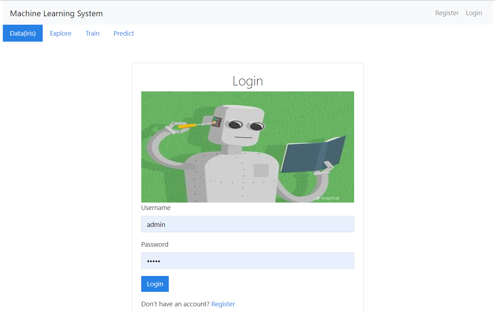
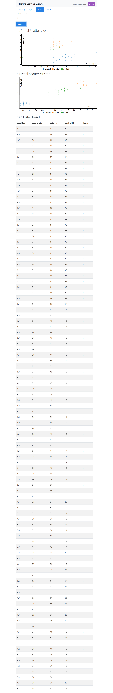

# Machine Learning System

## introduction

This project is a full stack FastAPI/React/Redux app that uses token based authentication with FastAPI users/FastAPI Hive library.

Then I add Machine Learning features for demostrate the full workflow of the data mining, including the four stage corresponding to four pages:
1. data management
2. data explore
3. model train
4. prediction

The data set is the classic iris data, which is only for demo, and this project is from my interest. so you can reference, but the quality is not assured.

## features

* authentication functions
> login from login page
> register your account
> logout from inner page

* data management
> view iris items

* data explore
> inspect attribute distribution through histogram
> inspect sepal distribution through scatter graph
> inspect petal distribution through scatter graph

* model train
> input cluster number
> train a cluster model using sklearn-kmeans library
> inspect cluster result through sepal and petal scatter

* prediction
> input iris sepal and petal attributes
> predict iris cluster

## technology stack


category | name | comment
---------|----------|---------
 frontend | reactjs | frontend framework
 frontend | redux | state management
 frontend | react-C3JS | D3 based graph tool
 frontend | react-bootstrap | style component library
 frontend | data-ui | react data visualization tool
 backend | FastAPI | backend framework
 backend | FastAPI users | authentication library
 backend | FastAPI Hive | package modules layout library
 backend | sklearn | machine learning tool

## Quick Start

```bash
# Install dependencies
cd ./frontend
npm install

# Build for production
npm run build


# Install dependencies
cd ../backend
pip3 install -r requirements.txt

# Serve API on localhost:8000
uvicorn demo.main:app --reload
```

## snapshot

### login page


### model train page


### prediction page


